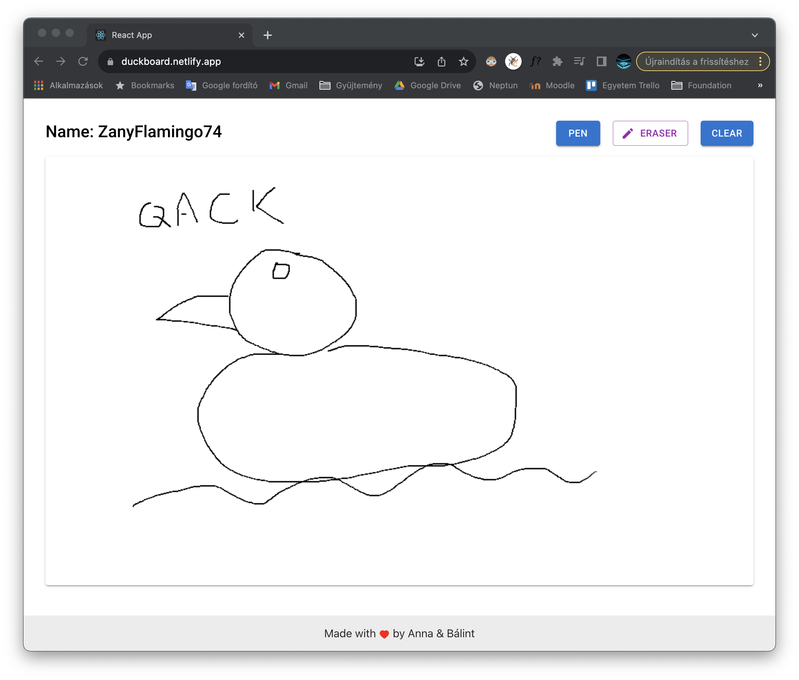
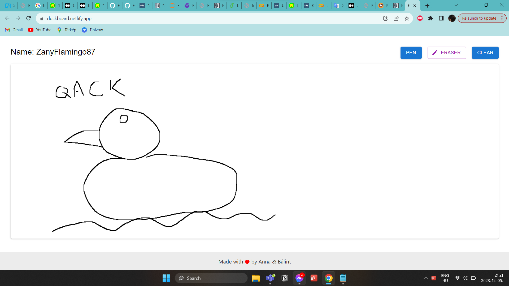

# Collaborative whiteboard

## Task Id és Cím
**Task ID:**#23_03d
**Cím:** Collaborative whiteboard

## Beadók
- Bálint Kostyál
- Do Hoang Anh

## Online alkalmazás

https://duckboard.netlify.app/

## Projekt célja
Csapatunk kihívás az volt, hogy egy whiteboard alkalmazást készítsen, amibe belépve a felhasználók együtt tudnak egy közös whiteboard-ot szerkeszteni. 

## Felhasznált eszközök
Projektünkhöz nagy mértékben felhasználtuk a chatgpt-t, illetve a github copilotot.
Mindkét eszköz nagyban meg tudja könnyíteni a fejlesztők életét, viszont nem varázslat egyik sem.
Okos és jó rendszerek, de gondolkodzni, és újat kitatlálni egyik sem tud helyettünk.
A kódok nagyrésze többszöri iteráción keresztül készült, és sokszor kellett javítani, mire a kívánt eredményt kaptuk.

Az alkalmazás backend része telepítésre került egy Kubernetes cluster-be, még a frontend Netlify-ra. A kitelepítés
során se a Copilot, se a ChatGPT nem segített, ezek csak a kód írásában voltak segítségünkre. Sajnos a kevésbé használt technológiákban nagyon nem jártas egyik se.

## Chatgpt-s beszélgetések
A react frontend készítése: https://chat.openai.com/share/04ede814-5c6c-4880-be1e-ed33da7f5178
- Nagyobb dolgokban tud segíteni ugyan, de gyakran terelgetni kell

React footer: https://chat.openai.com/share/b848499c-f647-48a7-a8e5-2789effaf5fa 
- Megfelelő instrukciók mellett, kis taszkokra bontva, a chatgpt nagyon jól tud segíteni a fejlesztésben.

Backend alap struktúra generálás: https://chat.openai.com/share/ba4a142d-7c3b-4267-a2b9-3129bebe90b1
- Ha az embernek egy alap ötlete, és azt jól megfogalmazza, akkor a chatgpt tud belőle egy félig meddig működő proof of concept-et generálni.
- Meglévő kódhoz pedig tökéletesen tud ReadMe.md file-t generálni.

Backend kiegészítés: https://chat.openai.com/share/e763f892-69f1-4d73-a0a7-c1f368fc7945
- Ha kap egy kész kódot, abba új feature-t egész jól tud generálni.

Kubernetes-es hibakeresés: https://chat.openai.com/share/aa61eecc-754c-4218-94a3-ddb166ff1b7a
- Specifikus hibakeresésben csak nagyon általános választ adott. A hiba megoldásában nem segített.

## A működés bemutatása

A demo a már kitelepített környezetben érhető el: https://duckboard.netlify.app/

### Az egyik böngésző:

### A másik böngésző:

## Tanulságok
Arra jutottunk, hogyha értünk egy adott témához, akkor a chatgpt sokat segíthet, azonban, ha valamilyen témához egyáltalán nem értünk, akkor viszont nem mindig tudjuk megérteni és beilleszteni a megfelelő helyre az AI által generáltakat.
Maga az alkalmazás ennek megfelelően eléggé instabil, és nagyon erősen demo jellegű, de a lényeg, hogy működik.